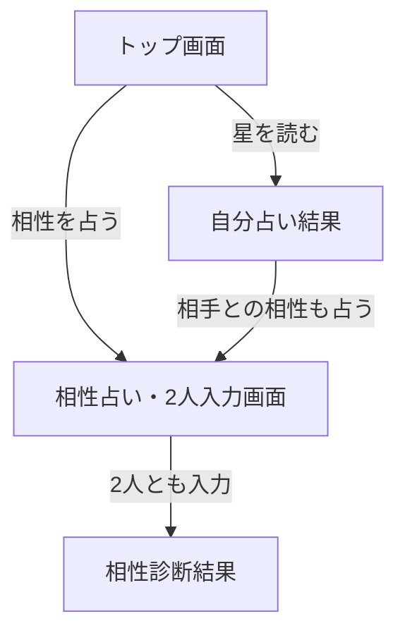

## はじめに

恋愛相性だけだった相性占いを、友達相性・仕事相性にも広げようとしていた。そのなかで、次に考えていたのはシェアだ。占った結果をSNSで拡散できる仕組みがあれば、口コミで自然にアクセスが増える。集客の問題を実装で解決できる部分がある、と思い始めていた。

そのシェアの仕組みをどう作るか、頭の中で考えながら自分のアプリを触っていた。そこで、ひとつの不足に気づいた。

**今の相性占いは、自分が必ず片方に固定される。**

「自分×好きな人」は占えるが、「友人A×友人B」のように、自分が当事者でない組み合わせは占えない仕様になっていた。シェアを構想するより先に、足元を整える必要があった。

---

## 1. まず、3種類の相性で「見る天体」を変えた

友達相性と仕事相性を足すにあたり、最初に決めたのは「どの天体で相性を見るか」だった。

恋愛相性は太陽・月・金星の3天体を使っている。金星は愛情や美意識を表す惑星で、恋愛の文脈では核心的な意味を持つ。でも友達関係や仕事関係に金星を当てはめるのは少しずれる。

友達相性では太陽・月・水星を使うことにした。水星はコミュニケーションやフィーリングを表す惑星で、「話が合うか」「一緒にいて心地よいか」という友情の文脈に合うと判断した。仕事相性では太陽・水星・火星にした。火星は実行力やエネルギーを表し、「一緒に動けるか」という仕事の観点に近い。

文章のトーンも3種類で作り分けた。友達相性のコメントに恋愛的な語彙が混ざると違和感が出る。友情には友情の、仕事には協働の文脈で書き分けることで、3つのメニューがそれぞれ独立して成り立つようにした。

結果、相性文は全部で864パターンになった。これをClaude Codeに生成させた。

このとき、前にやらかしたのと同じ失敗を繰り返した。一度に多くのパターンを生成させようとして、途中でClaude Codeの出力が止まった。恋愛相性の432パターンを作ったときにも同じ壁にぶつかって、「次は分割して渡す」と学んだはずだった。なのに同じことをした。

結局、星座1つずつに分割して生成する、という前回と同じ地道なやり方に落ち着いた。学びが定着していなかった、という話だ。

---

## 2. シェアを考えるうちに、使われ方の幅が見えてきた

シェアを作る前に、「誰が、どんな場面でシェアするのか」を想像した。

「友達のAさんとBさんって、相性どうなんだろう」「あの二人の関係を占ってみたい」——そういう使い方は、自然に起きると思った。シェアで広がるには、使う側が「これを試させたい」と思える場面が必要だ。

でも今の作りでは、相性を占うには「自分」が必ず片方に入る。自分占いを先に済ませて、その結果を引き継ぐ前提でフォームが作られていた。入力欄は相手の1人分しかなく、自分は固定されている。

しかもトップから相性占いに直接入れる導線がなかった。一度自分占いを経由しないと、相性占いのページに辿り着けない構造だった。

シェアして広げる前に、まず**誰と誰でも気軽に2人で占える形**に整える必要がある。気づくまで少し時間がかかったが、機能を足すことと、使われる形にすることは別の話だった。

*トップ画面。自分占い（無料）の下に「相性を占う」への導線を置いた。*

---

## 3. 設計はClaudeと壁打ちし、画面遷移を図にして固めた

気づいてから、すぐに実装に入らなかった。まず画面遷移をClaudeとのチャットで壁打ちした。

今の相性占いには2つの入口がある。

1. **トップから直接**：何も情報を持たない状態で相性占いに入る
2. **自分占いの結果から**：自分のデータを持った状態で相性占いに入る

2人の生年月日を入力させる場合、この2つの入口でどう挙動を分けるか。

議論になったのが「自分を呼び出すボタン」の扱いだ。自分占い済みのデータを「1人目として自動入力する」ボタンがあると便利だが、そのボタンを1個にするか、「1人目に入れる」「2人目に入れる」と2種類用意するか。

壁打ちで出た結論はこうだった。

- **2人とも入力フォームにする**（自分が必ずどちらかに入る、という制約をなくす）
- **「自分のデータを呼び出すボタン」を1人目の入力欄に1個だけ置く**（シンプルさを優先した）
- **トップから直接入れる導線を作る**

*2つの入口（トップから直接／自分占いの結果から）が、ともに同じ2人入力画面に合流する。*

この設計を図にして固めてから、実装に移ることにした。連載を通じて続けてきた「設計はClaudeとの壁打ち、実装はClaude Code」という分担だ。

---

## 4. 実装はClaude Codeに、2段階で渡した

設計が固まったあと、Claude Codeに渡す指示を書いた。

一度に全部やらせず、**2段階に分けた**。

- **第1段階**：ロジックと画面遷移の骨格（2人分の入力フォーム、データの引き継ぎ、遷移フロー）
- **第2段階**：見た目の仕上げ（ボタン配置、ラベル表記、モバイル表示の調整）

なぜ分けたか。一度に大きく変えると、どこで動かなくなったか特定が難しくなる。週5時間の副業では、確実に動く単位で進んでいくほうが安全だ。壊れた状態で詰まると、次の作業時間まで放置される。

1段階目が終わったところで、画面遷移と入力フローを自分で通してみた。大きな問題がないことを確認してから、2段階目の見た目調整をClaude Codeに渡した。

---

## 5. バグは実機で見つかった

完成したつもりで、iPhoneで触った。

トップから相性占いに直接入ると、「自分のデータを呼び出す」ボタンが表示されなかった。

*2人入力画面。右上の「自分を呼び出す」ボタンが、トップから入ったときだけ表示されないバグがあった。*

原因はすぐわかった。そのボタンの表示を「自分占いを済ませたかどうか」で判定していた。でもトップから直接入ると、自分占いを経由しない。だからボタンが出なかった。

「自分占いを経由したか」ではなく、「セッションに自分のデータが保存されているか」で判定するように直した。自分占いのデータが残っていれば、どの入口から入っても呼び出しボタンが表示される。

PCのエミュレータでは2つの入口を都合よく試していたので、このバグには気づけなかった。実機で実際の動線を触ってみて、初めて見つかった。実機確認を最後に挟む重要さを、また実感した。

---

## まとめ

機能を足すことと、使われる形に整えることは別だった。

友達相性・仕事相性のメニューを足してから、「相性占い＝自分が必ず入る」という前提に気づくまで、少し時間がかかった。自分が作ったものの制約は、作ったそのときには見えにくい。シェアを構想する中で外から見る視点が入ってきたおかげで、ようやく気づけた。

週5時間の副業でも、設計を壁打ちで固めてから実装に渡すやり方は変わらない。この順番を守ることで、作り直しの回数は少なく済んでいると感じている。

アプリ開発としては、次はシェア機能に取り組む予定だ。相性占いが「誰と誰でも占える形」に整ったことで、ようやくその土台ができた。

ただ、その前に書いておきたいことがある。この開発の途中で、いくつかやらかしている。同じ失敗を繰り返したり、運用で危うい場面があったり。次回は、その失敗の話を書く。

---

*このZenn連載は、Claude Codeを使って副業アプリを作る過程をそのまま記録しています。前回の記事はこちら → [Claude Codeで作った占いアプリに人が来ない──AIと「集客戦略」を壁打ちした話](https://zenn.dev/kaminotk4/articles/strategy-sparring-with-ai)*
